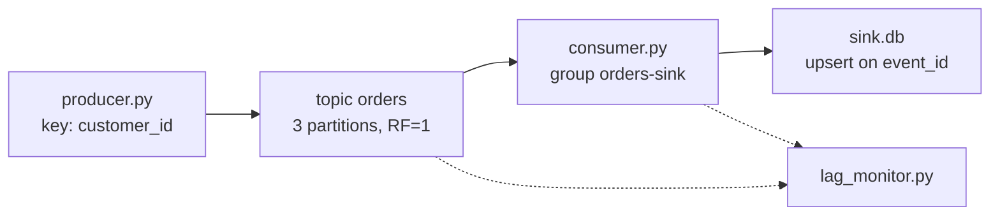

# streaming-service

Local Kafka demo of produce/consume mechanics using the same synthetic e-commerce **order events** domain as `airflow-dbt-warehouse` (customer, order status, order total), with an `event_id` for sink dedup — not Hacker News, not market data.

`kafka_streaming/` and `webscraping/` are the original Hacker-News scraper + FastAPI UI demo. They are not the mechanics demo described below.

Single-broker local demo, not a throughput benchmark.

## Architecture

```
  producer/producer.py
    synthetic order events, key = customer_id
           |
           v
  Kafka topic "orders"  (3 partitions, replication factor 1, one KRaft broker)
           |
           v
  consumer/consumer.py   group = orders-sink
    at-least-once: upsert SQLite then commit offset
           |
           v
  sink.db  (PRIMARY KEY event_id)

  consumer/lag_monitor.py  -> JSON {partition, committed, end, lag}
```



## What this shows

- **Partitioning / ordering:** same `customer_id` → same partition (`produce_events`). Global order would need one partition; this topic has three.
- **Delivery:** at-least-once (`enable.auto.commit=false`, `consumer.commit()` after `OrderEventSink.upsert`). Not Kafka transactions.
- **Lag:** `report_lag` compares committed vs end offsets per partition.
- **Rebalance:** `LoggingRebalanceListener` prints revoke/assign. Two-member capture: [evidence/rebalance.md](evidence/rebalance.md).

Details: [docs/kafka-concepts.md](docs/kafka-concepts.md). Evidence: [evidence/lag.md](evidence/lag.md), [evidence/rebalance.md](evidence/rebalance.md).

## How to run

Requires Docker (for the broker) and Python 3.11+. Commands assume the repo root.

```bash
python -m pip install -r requirements.txt
docker compose up -d --wait
python producer/producer.py --count 20
python consumer/consumer.py --max-records 20 --timeout-s 20
python consumer/lag_monitor.py
pytest tests/ -q
```

If host port **9092** is already in use, map **9094:9092** in `docker-compose.yml`, set `KAFKA_ADVERTISED_LISTENERS` `PLAINTEXT_HOST://localhost:9094`, and export `KAFKA_BOOTSTRAP=localhost:9094`.

Stop the broker with `docker compose down`.

CI (`.github/workflows/ci.yml`) starts the same compose stack on `ubuntu-latest` and runs pytest against `localhost:9092`.
